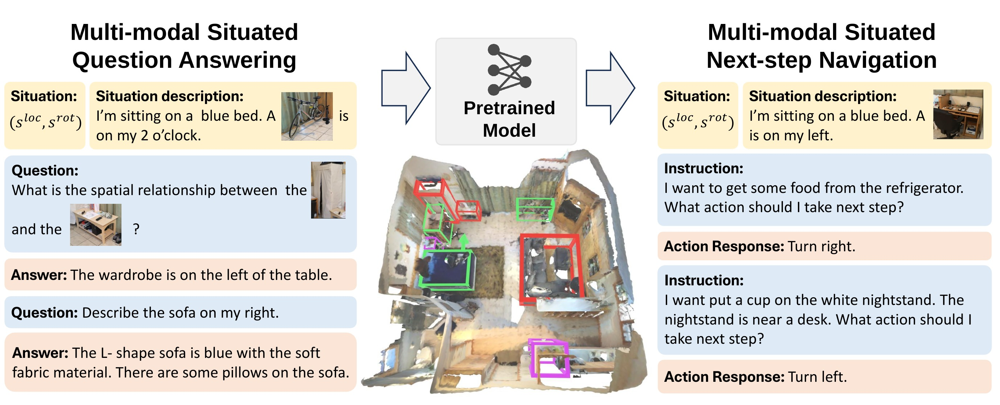

<h2 align="center">
  <b> Multi-modal Situated Reasoning in 3D Scenes</b>
</h2>

<a target="_blank" href="https://github.com/Germany321">Xiongkun Linghu✶</a>,
<a target="_blank" href="https://nxsedson.github.io/">Xuesong Niu✶</a>,
<a target="_blank" href="https://huangjy-pku.github.io/">Jiangyong Huang</a>,
<a target="_blank" href="https://jeasinema.github.io/">Xiaojian Ma</a>,
<a target="_blank" href="https://buzz-beater.github.io/">Baoxiong Jia</a>,
<a target="_blank" href="https://siyuanhuang.com/">Siyuan Huang</a>

&nbsp;

    
    
    
    
    

&nbsp;

### TODO

- [x] Test set
- [ ] Train/val set
- [ ] Point cloud and images
- [ ] Evaluation code
- [ ] Training code
